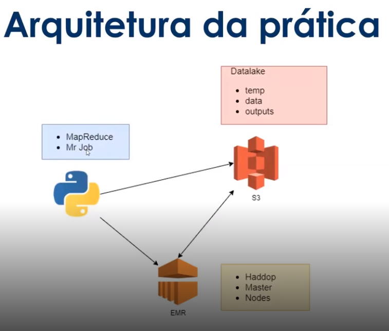
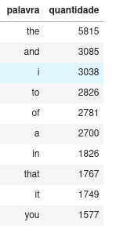

# DiogitalInnovation One - Bootcamp Cognizant Cloud Data Engineer
## Desafio - Criando seu Ecossistema de Big Data na Nuvem

Ministrado por: Cassiano Peres

Algoritmo de extração/contabilização de palavras. Para isso, você pode ordenar as palavras por ocorrência e não por ordem alfabética , (apresentando as mais citadas no texto com prioridade), para o desafio, utilizer o AWS EMR e Python

### Arquitetura



#### Configurando ambiente Python

##### Poetry

O que é?

Poetry é uma ferramenta de gerenciamento de dependências do python. Auxilia na instalação de pacotes e ajuda na configuração do ambiente de desenvolvimento.

Para que serve?
Utilizaremos o poetry para controlar a versão das bibliotecas utilizadas para desenvolvimento do sistema. Com ele podemos baixar uma versão específica de uma biblioteca ou facilmente atualizar suas dependências.

Ele também nos ajuda a manter um ambiente isolado de desenvolvimento entre pacotes e dependências.

O poetry nos ajuda a ter um ambiente separado para cada projeto.

Como instalar?
Abra um terminal e digite:

```bash
curl -sSL https://raw.githubusercontent.com/python-poetry/poetry/master/install-poetry.py | python -
```

##### Iniciando um projeto Python

Execute o comando:
```bash
poetry init -n
```
Obs: A opção -n evita que o poetry fique perguntando algumas opções do projeto. Considere remove-la em próximos projetos.

Este comando iniciliza um arquivo `pyproject.toml` de configuração do projeto.

Com o projeto iniciado, vamos instalar as dependências.


#### Amazon S3

O Amazon Simple Storage Service (Amazon S3) é um serviço de armazenamento de objetos que oferece escalabilidade, disponibilidade de dados, segurança e performance líderes do setor. Isso significa que clientes de todos os tamanhos e setores podem usá-lo para armazenar e proteger qualquer volume de dados em vários casos de uso, como data lakes, sites, aplicações para dispositivos móveis, backup e restauração, arquivamento, aplicações empresariais, dispositivos IoT e análises de big data. 

O Amazon S3 fornece recursos de gerenciamento fáceis de usar, de maneira que você possa organizar os dados e configurar os controles de acesso refinados para atender a requisitos específicos comerciais, organizacionais e de conformidade. 

O Amazon S3 foi projetado para 99,999999999% (11 noves) de durabilidade e armazena dados de milhões de aplicações para empresas em todo o mundo.

##### Amazon EMR

O Amazon EMR é a plataforma de big data em nuvem líder do setor para processar grandes quantidades de dados usando ferramentas de código aberto, como Apache Spark, Apache Hive, Apache HBase, Apache Flink, Apache Hudi e Presto. Com o EMR, você pode executar análises em escala de Petabytes.

Com é possível criar um cluster Hadoop com poucos cliques e sem a necessidade de instalar nada de forma manual, o que diminui muito a complexidade do seu ambiente de Big Data. 

O EMR possui uma estrutura de custo por processamento e tempo de execução, sendo ideal para atividades de processamento de dados por demanda, pois você só irá pagar pelo tempo que o cluster estiver executando.

##### MapReduce

O MapReduce é um modelo de programação, uma forma de escrever algoritmos que foi proposto pelo Google para processar grandes volumes de dados (Big Data). O MapReduce é baseado em conceitos da programação funcional.

##### MRJob

O MRJob é uma biblioteca open source para Python que se propõe a nos ajudar a escrever algoritmos no modelo MapReduce de forma simples e bonita. O intuito é diminuir a complexidade da escrita de algoritmos que muitas das vezes a linguagem Java e Scala trazem neste processo.

Como instalar?

Execute o comando:
```bash
poetry add mrjob
```

##### boto3

Boto3 é o kit de desenvolvimento de software(SDK) da Amazon Web Services(AWS) para Python, que permite aos desenvolvedores de Python escrever software que faz uso de serviços como Amazon S3 e Amazon EC2.

Como instalar?

Execute o comando:
```bash
poetry add boto3
```

## Instruções

* Acessar S3: https://s3.console.aws.amazon.com/s3/ 
  * Criar estrutura de data lake : _dio-live-datalake_
  * Criar estrutura de pastas:
    * _data_
    * _output_
    * _temp_
* Acessar EMR: https://console.aws.amazon.com/elasticmapreduce/
    * O cluster será criado pelo MrJob e não pelo console
    * Infraestrutura como código 
* Criar chave SSH
    * Acessar  Console do EC2: https://console.aws.amazon.com/ec2/ -> Key Pairs -> Create Key Pair	
    * Download .pem file
* Obter Id e chave secreta AWS para configurar MrJob
   * Profile
   * My Security Credentials: https://console.aws.amazon.com/iam/home?region={region}#/security_credentials
   * Access Keys - Create new access key
   * Fazer download - única chance de visualizar
* Ambiente linux
   * Criar ambiente virtual python: _virtualenv --python=python3.6 venv_diolive_
   * Acessar com o vs code
* Instalar vscode no Ubuntu
   *  code .
* Criar algoritmo de análise de palavras
   * dio-live-wordcount-test.py
   * map-reduce-count : contar
* Acessar S3
   * Upload de arquivo para o bucket
* Ambiente virtual python: source venv_teste/bin/activate
  * _nano ~/.mrjob.conf_
  * _python3 dio-live-wordcount-test.py -r emr s3://{your_s3_bucket_name}/data/SherlockHolmes.txt --output-dir=s3://{your_s3_bucket_name}/output/logs1 --cloud-tmp-dir=s3://{your_s3_bucket_name}/temp/_


## Apresentando Resultado com Nuvem de Palavras


A nuvem de palavras ou word cloud é uma forma super legal de ilustrar informações textuais de forma gráfica, atrativa e de fácil compreensão para muitas pessoas. Para construir a sua nuvem de palavras de forma muito simples em python utilizando as bibliotecas wordcloud, pandas, matplotlib.
O codigo da criação dessa nuvem esta no arquivo `analizando_palavras.ipynb`

#### As 10 primeiras palavras


#### Nuvem de palavras
